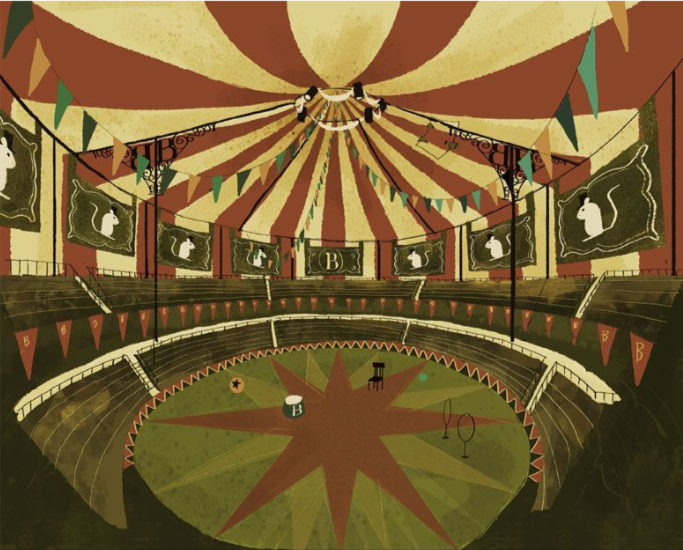
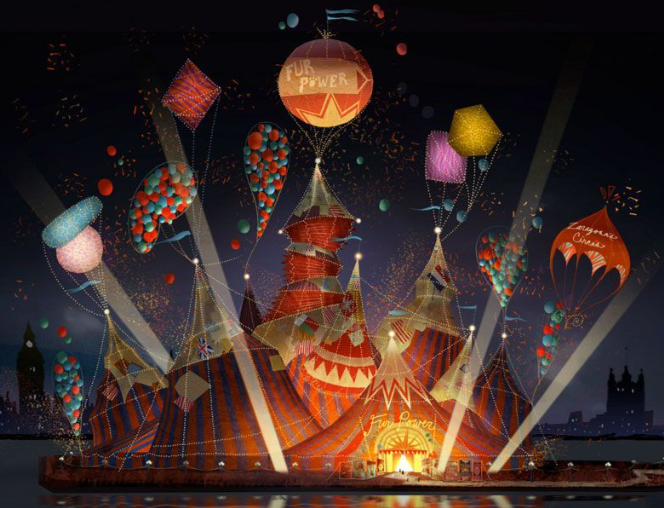
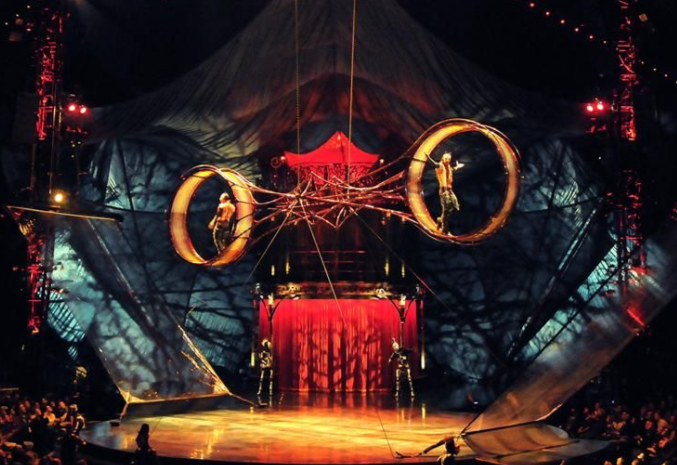
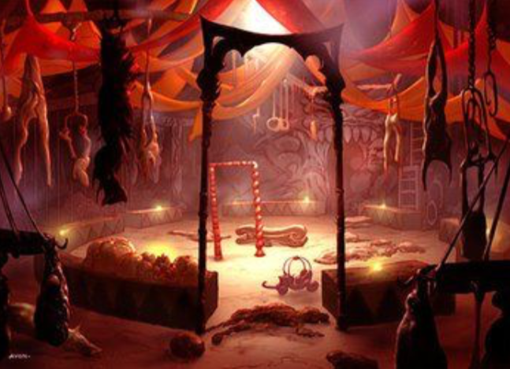
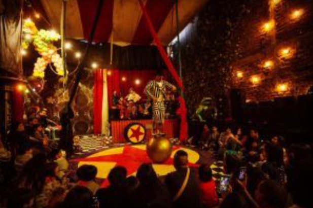
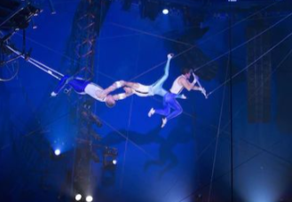
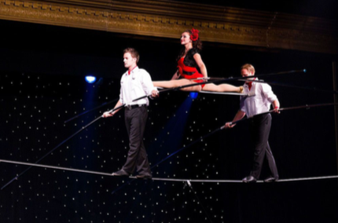
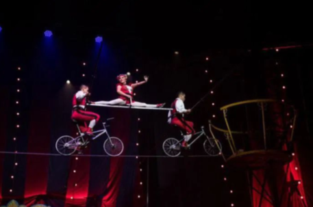
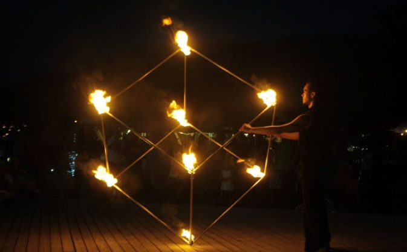
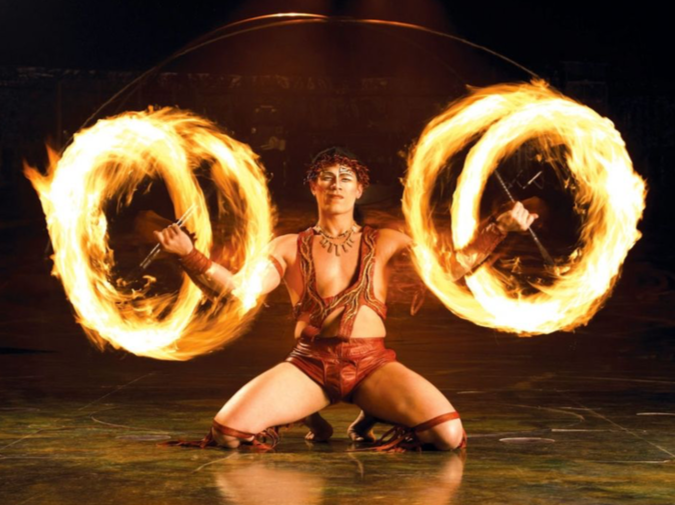

# Laboratorio Computación Gráfica 2020-1
Código y recursos desarrollados para el proyecto final de **Teoría** de la materia **Computación gráfica** para el semestre **2020-1**.

Proyecto para el **Ing. Arturo Pérez de la Cruz**

## Integrantes del proyecto:

- Luis Ernesto Ochoa Ríos  [GitHub - Leor8a](https://github.com/Leor8a)

Pues si, aunque no lo quize pero las circunstancias lo dictan, un proyecto de un **One orchestra man**.

## Descripción del proyecto detallado:

El proyecto se estructurará en las siguientes carpetas:

```bash
//TO DO: Modificación de estructura de carpetas...

Computacion_Grafica_2020-1
│  
├── Teoría
│   ├── Miniprog
│   ├── Images
│   ├── #########
│   ├── Mac
│   │   ├── #########
│   │   ├── README.md
│   ├── Windows
│   │   ├── #########
│   │   ├── README.md
│   ├── DESARROLLO.md Leer para más detalles del desarrollo del proyecto.
│   └── README.md ** (Éste es el archivo que estás leyendo)
└── README.md 

```

## Lineamientos:

**Descripción general del proyecto** y algunos lineamientos:

El alumno, presentará como proyecto final, un escenario tridimensional, el cual consistirá principalmente en:

1) Un **circo**:

a) Se deberá realizar un recorrido virtual de un circo donde se incluirán elementos generados por cada alumno en específico. Además de una ambientación tridimensional para simular lo mejor posible el ambiente virtual. A continuación se muestran algunas imágenes de referencia:







Para todos los elementos, el alumno utilizará las técnicas de modelado geométrico, modelado jerárquico y texturizado para construir los elementos con base a primitivas.

Se deberá realizar el ambiente virtual lo más completo posible tanto al interior como al exterior, colocando diversos elementos como: Carpa, gradas, personas, actos, ambientación, etc.

 Especificaciones:
-

b) Se deberán colocar mínimo **2 actos** distintos al interior del circo, deberá estar correctamente modelado, texturizado y animado. Estos actos deberán ser de tipo aéreo y de piso, buscando que sean lo más realista posible.

Referencia Visual de acto de tipo aéreo:





Referencia Visual de acto de piso:




Ambos deberán contener su respectiva animación de funcionamiento (ciclo del acto). Lo demás podrá ser generado como mejor lo consideren. Todo el circo deberá estar correctamente texturizado.

c) Deberá contener dos modos de visualización.

- Modo de día: Se deberán visualizar los modelos correctamente texturizados sin iluminación.

- Modo de noche: Se deberán visualizar los modelos con iluminación y materiales adecuadamente al ambiente nocturno.

d) Se generarán **dos** opciones para el recorrido, uno para hacerlo de manera **libre** y otro con **recorrido preestablecido**.

e) Deberá contener mínimo 2 animaciones adicionales a las de los 2 actos diferentes, éstas animaciones deberán ser complejas en el escenario para que sea dinámico.

f) El proyecto deberá ser entregado en una memoria entrada USB, donde se colocará el proeycto de visual studio, al menos 3 videos diferntes del proyecto funcionando y un maual de usuario. El manual de usuario deberá estar en formato .pdf y debe contener capturas de pantalla que ejemplifiquen cada elemento que describen en el manual y al final capturas de pantalla del proyecto. 

**Además de la memoria el proyecto deberá estar en un repositorio exclusivo donde se evaluará cada avance que se vaya realizando en él.**


g) Incorporará una biblioteca de audio para agregar música de fondo, por lo que el alumno deberá investigar una biblioteca compatible con OpenGL y GLUT. **(La herramienta que se utilizará será irrKlang para la carga de audio en el proyecto.)**


h) Junto con los archivos de código, modelos, texturas y de audio, que el alumno utilizó para crear el escenario, entregará un manual de uso de la aplicación.


Éstos son los elementos **mínimos** que debe haber en el escenario, no significa que sean los únicos, cada equipo deberá ambientar el escenario lo mejor posible, se evaluará además la creatividad y originalidad.

 Participantes:
-

Podrán formar equipos hasta de **2 personas** o se puede realizar de manera individual. (Ya se redujo a una persona)

Es responsabilidad del alumno la selección de integrantes del equipo, por lo que las acciones de alguno de los miembros del equipo repercute en todos los integrantes.

Cualquier uso no autorizado de proyectos de semestres anteriores, o contenido generado por otro equipo llevará a, dependiendo la gravedad de la falta, una calificación de **cero** en el rubro de proyecto o a tener una calificación reprobatoria en la materia.
Cualquier otro punto no previsto en este documento será tratado entre el profesor y las personas involucradas.

Criterios a Evaluar:
-
| Criterios de evaluación |                                                                                                       | Puntuación Obtenida | Detalles                                                                                                                                                                                                               | Máximo Posible |                      |
|:-----------------------:|-------------------------------------------------------------------------------------------------------|---------------------|------------------------------------------------------------------------------------------------------------------------------------------------------------------------------------------------------------------------|----------------|----------------------|
| Presentación            |                                                                                                       |                     | El alumno está entregando  un proyecto para su evaluación.  Por lo cual la presentación del proyecto es algo implícito (-5 a 10 puntos) |             10 |                      |
| Modelado                | Geometría acto 1                                                                                      |                     | Modelado desde cero (-5 a 10 puntos)                                                                                                                                                                                   |             20 |                      |
|                         | Texturizado acto 1                                                                                    |                     | Texturizado por completo (-5 a 10 puntos)                                                                                                                                                                              |             10 |                      |
|                         | Geometría acto 2                                                                                      |                     | Modelado desde cero (-5 a 10 puntos)                                                                                                                                                                                   |             20 |                      |
|                         | Texturizado acto 2                                                                                    |                     | Texturizado por completo (-5 a 10 puntos)                                                                                                                                                                              |             10 |                      |
| Animaciones             | Animación acto 1                                                                                      |                     | Animación del ciclo completo del juego  (-5 a 20 puntos)                                                                                                                                                               |             20 |                      |
|                         | Animación acto 2                                                                                      |                     | Animación del ciclo completo del juego  (-5 a 20 puntos)                                                                                                                                                               |             20 |                      |
|                         | Animación adicional 1                                                                                 |                     | Se evalúa dificultad y creatividad  (-5 a 10 puntos)                                                                                                                                                                   |             10 |                      |
|                         | Animación adicional 2                                                                                 |                     | Se evalúa dificultad y creatividad  (-5 a 10 puntos)                                                                                                                                                                   |             10 |                      |
| Materiales              | Materiales al usar  el modo nocturno                                                                  |                     | Que se aprecie la iluminación y  los materiales adecuadamente  (-5 a 30 puntos)                                                                                                                                        |             30 |                      |
| Manual de usuario       | Existe (jajajaja)                                                                                     |                     | Está en el proyecto (-15 a 10 puntos)                                                                                                                                                                                  |             10 |                      |
|                         | Descripción                                                                                           |                     | Está claro y con imágenes de ejemplo  (-5 a 10 puntos)                                                                                                                                                                 |             10 |                      |
|                         | Contiene  capturas de pantalla                                                                        |                     | (-5 a 10 puntos)                                                                                                                                                                                                       |             10 |                      |
| Manejo de la cámara     | Modo Libre                                                                                            |                     | (-5 a 10 puntos)                                                                                                                                                                                                       |             10 |                      |
|                         | Modo Recorrido                                                                                        |                     | Está bien definido el recorrido  (-10 a 20 puntos)                                                                                                                                                                     |             20 |                      |
|                         | Ambientación  Adicional                                                                               |                     | Originalidad y creatividad (-15 a 100 puntos)                                                                                                                                                                          |            100 |                      |
| Elementos adicionales   | Efectos visuales adicionales                                                                          |                     | Originalidad y creatividad  (0 a 100 puntos)                                                                                                                                                                           |                |                      |
|                         | Animaciones adicionales                                                                               |                     | Originalidad y creatividad  (0 a 50 puntos)                                                                                                                                                                            |                |                      |
|                         | Extra (Como se explicó en clase  cualquier elemento extra que aporte  significativamente al proyecto) |                     | Originalidad y creatividad  (0 a 100 puntos)                                                                                                                                                                           |                |                      |
|                         |                                                                                                       |                     |                                                                                                                                                                                                                        | 320            | Calificación  Máxima |


 Desarrollo de proyecto:
-

Ver DESARROLLO.md

 Licenciamiento:
-

Ver LICENSE.md
